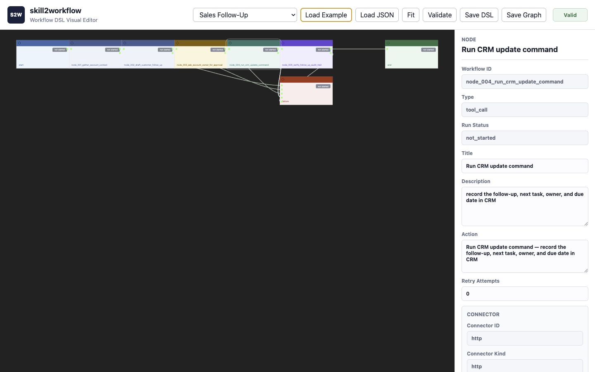
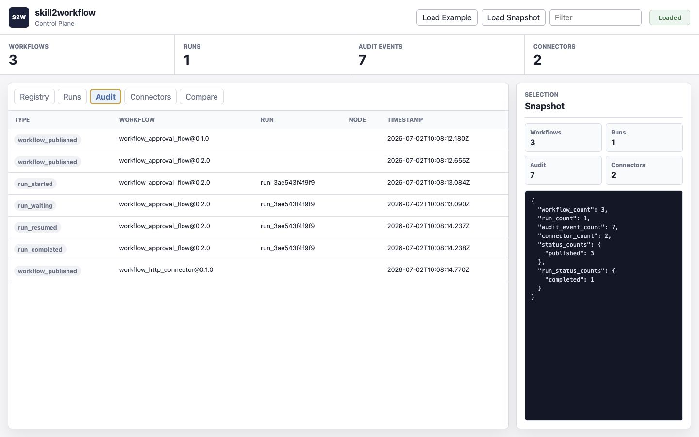
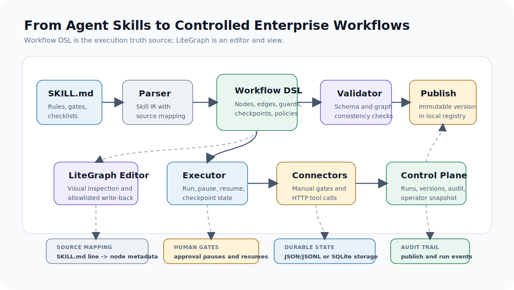

# skill2workflow

From Agent Skills to Controlled Enterprise Workflows.

`skill2workflow` is an open-source Agent Workflow Runtime for enterprise AI adoption. It converts standard `SKILL.md` capability descriptions into controlled workflows that can be validated, visualized, executed, resumed, and audited.

The core idea is simple:

- Skills answer: "Can the agent do this?"
- Workflows answer: "Will it follow the required process every time?"
- A durable executor answers: "Can the process recover, pause, resume, and leave an audit trail?"

This repository is intentionally starting with a small executable harness instead of a large platform shell. The first closed loop is:

```text
SKILL.md -> Skill IR -> Workflow DSL -> Local Executor -> Run Log
```

LiteGraph visualization, enterprise control plane features, and connector expansion are part of the staged roadmap in the approved spec.

## Visual Overview

### Controlled Workflow Authoring

<p align="center">
  
</p>

The visual editor loads Workflow DSL, renders it as a LiteGraph-compatible graph, and exposes allowlisted edits for node text, retry policy, actions, and HTTP connector request metadata. The graph is a view and editor; Workflow DSL remains the execution truth source.

### Local Control Plane And Audit Trail



The local control-plane inspector reads exported snapshots so operators can inspect published workflow versions, runs, audit events, connectors, and version comparisons without adding a server dependency.

### System Design



## Why This Exists

Agent skills have already proven useful for adapting AI systems to new tasks. They are fast to write, easy to share, and effective for many lightweight tasks.

Enterprise workflows need more control:

- Mandatory execution order
- Human approval gates
- Durable state
- Failure handling
- Recoverability
- Versioning
- Auditability
- Integration hooks

`skill2workflow` bridges that gap by compiling skills into an execution-controlled workflow runtime.

## Current Harness

The current implementation is a dependency-light Python harness because the local bootstrap environment does not include Node.js or npm. It implements the first executable slice of the product:

- Parse standard `SKILL.md` into Skill IR
- Preserve checklist source mapping with step title, detail, section, and line number
- Normalize numbered lists, bullet lists, and markdown task checkboxes
- Ignore fenced code blocks when extracting rule hints
- Compile Skill IR into Workflow DSL
- Carry parser source mapping into workflow node metadata
- Validate Workflow DSL
- Document the Workflow DSL with a versioned JSON Schema
- Validate edge ids, edge endpoints, terminal-node edges, and node transition consistency
- Emit structured machine-readable validation errors
- Execute workflows locally
- Pause at `human_gate`
- Resume waiting runs
- Persist run state as JSON or opt-in SQLite
- List run summaries and inspect full run logs
- Store queryable run event rows when SQLite storage is enabled
- Bind `human_gate` nodes to the built-in manual connector
- Bind and validate `tool_call` connector metadata
- Execute minimal HTTP connector calls from connector-bound `tool_call` nodes
- Cover HTTP connector success, failure, invalid request metadata, JSON body, headers, and timeout behavior with local tests
- Honor connector-node `retry.max_attempts` and record retry/recovery events
- Convert Workflow DSL into LiteGraph-compatible graph JSON
- Open a static LiteGraph visual editor for graph inspection and parameter edits
- Write safe LiteGraph title and description edits back to Workflow DSL
- Write safe action, retry, and HTTP connector request edits back to Workflow DSL
- Load example workflows from the editor gallery
- Publish immutable workflow versions into a local control plane
- Run published workflow versions and write audit events
- Store workflow registry and audit metadata in JSON/JSONL or opt-in SQLite
- List built-in connector manifests
- Audit connector execution events through the control plane
- Audit runtime policy events such as `node_retrying`, `node_recovered`, and `node_failed` through the control plane
- Export a read-only control-plane snapshot with derived operator insights
- Inspect operator attention items, recent events, connector events, workflows, runs, audit events, and version deltas in a static local control-plane UI
- Inspect enterprise example workflows for sales, customer service, risk review, and operations analysis
- Generate a deterministic first-run demo workspace for contributor onboarding
- Verify editable install, package metadata, and the installed `skill2workflow` console script
- Run read-only release preflight checks for package version, release notes, tag availability, tests, and Python compilation
- Provide contributor, release, compatibility, and stability documentation for open-source evaluation

## Quickstart

Run the shortest local demo from a fresh checkout:

```bash
python3 scripts/demo_bootstrap.py --work-dir /tmp/skill2workflow-demo
```

The demo compiles `examples/skills/approval-flow/SKILL.md`, publishes and runs the workflow, resumes the approval gate, and writes artifacts under `/tmp/skill2workflow-demo/artifacts/`:

- `workflow.json`
- `workflow.litegraph.json`
- `control-plane-snapshot.json`

Open the local control-plane inspector:

```bash
python3 -m http.server 4173
```

Then open:

```text
http://localhost:4173/web/control.html
```

Load `/tmp/skill2workflow-demo/artifacts/control-plane-snapshot.json` to inspect the generated operator snapshot. Rerunning the demo resets the work directory by default; pass `--no-reset` to keep existing files.

Run the package install smoke:

```bash
python3 scripts/package_smoke.py --work-dir /tmp/skill2workflow-package-smoke
```

Or install the checkout in editable mode and use the console script directly:

```bash
python3 -m venv /tmp/skill2workflow-venv
/tmp/skill2workflow-venv/bin/python -m pip install --upgrade pip "setuptools>=68"
/tmp/skill2workflow-venv/bin/python -m pip install --no-build-isolation -e .
/tmp/skill2workflow-venv/bin/skill2workflow --help
/tmp/skill2workflow-venv/bin/skill2workflow validate examples/workflows/approval-flow.workflow.json --format json
```

The `PYTHONPATH=src python3 -m skill2workflow.cli ...` commands below remain the no-install source-checkout path.

Run tests:

```bash
PYTHONPATH=src python3 -m unittest discover -s tests -v
```

Parse a Skill:

```bash
PYTHONPATH=src python3 -m skill2workflow.cli parse examples/skills/approval-flow/SKILL.md
```

Compile a workflow:

```bash
PYTHONPATH=src python3 -m skill2workflow.cli compile examples/skills/approval-flow/SKILL.md -o /tmp/skill2workflow-workflow.json
```

Validate it:

```bash
PYTHONPATH=src python3 -m skill2workflow.cli validate /tmp/skill2workflow-workflow.json
```

Emit structured validation errors:

```bash
PYTHONPATH=src python3 -m skill2workflow.cli validate /tmp/skill2workflow-workflow.json --format json
```

Generate LiteGraph JSON:

```bash
PYTHONPATH=src python3 -m skill2workflow.cli visualize /tmp/skill2workflow-workflow.json -o /tmp/skill2workflow-litegraph.json
```

Apply safe LiteGraph edits back to Workflow DSL:

```bash
PYTHONPATH=src python3 -m skill2workflow.cli write-back /tmp/skill2workflow-workflow.json /tmp/skill2workflow-litegraph.json -o /tmp/skill2workflow-edited-workflow.json
```

Open the LiteGraph editor:

```bash
python3 -m http.server 4173
```

Then open:

```text
http://localhost:4173/web/
```

The editor can load either Workflow DSL JSON or the LiteGraph JSON generated by `visualize`. `Save DSL` writes edited node titles and descriptions back to Workflow DSL while preserving node ids, edges, transitions, source metadata, guards, checkpoints, and policies.
It also supports allowlisted authoring fields for actions, retry attempts, and HTTP connector request metadata.

Run it:

```bash
PYTHONPATH=src python3 -m skill2workflow.cli run /tmp/skill2workflow-workflow.json --state-dir /tmp/skill2workflow-state
```

Run it with SQLite-backed run storage:

```bash
PYTHONPATH=src python3 -m skill2workflow.cli run /tmp/skill2workflow-workflow.json --state-dir /tmp/skill2workflow-state --storage sqlite
```

Resume a waiting run:

```bash
PYTHONPATH=src python3 -m skill2workflow.cli resume <run_id> --state-dir /tmp/skill2workflow-state
```

For SQLite-backed runs, pass `--storage sqlite` to `resume`, `runs`, and `show` as well.

List local run summaries:

```bash
PYTHONPATH=src python3 -m skill2workflow.cli runs --state-dir /tmp/skill2workflow-state
```

Inspect a full run log:

```bash
PYTHONPATH=src python3 -m skill2workflow.cli show <run_id> --state-dir /tmp/skill2workflow-state
```

Publish a workflow version:

```bash
PYTHONPATH=src python3 -m skill2workflow.cli publish /tmp/skill2workflow-workflow.json --state-dir /tmp/skill2workflow-control
```

Publish with SQLite-backed control-plane metadata:

```bash
PYTHONPATH=src python3 -m skill2workflow.cli publish /tmp/skill2workflow-workflow.json --state-dir /tmp/skill2workflow-control --storage sqlite
```

List and inspect published workflow versions:

```bash
PYTHONPATH=src python3 -m skill2workflow.cli workflows --state-dir /tmp/skill2workflow-control
PYTHONPATH=src python3 -m skill2workflow.cli workflow workflow_approval_flow --version 0.1.0 --state-dir /tmp/skill2workflow-control
```

Run a published version and inspect audit events:

```bash
PYTHONPATH=src python3 -m skill2workflow.cli run-published workflow_approval_flow --version 0.1.0 --state-dir /tmp/skill2workflow-control
PYTHONPATH=src python3 -m skill2workflow.cli resume-published <run_id> --state-dir /tmp/skill2workflow-control
PYTHONPATH=src python3 -m skill2workflow.cli control-runs --state-dir /tmp/skill2workflow-control
PYTHONPATH=src python3 -m skill2workflow.cli control-run <run_id> --state-dir /tmp/skill2workflow-control
PYTHONPATH=src python3 -m skill2workflow.cli audit --state-dir /tmp/skill2workflow-control
```

Use SQLite run storage for published runs:

```bash
PYTHONPATH=src python3 -m skill2workflow.cli run-published workflow_approval_flow --version 0.1.0 --state-dir /tmp/skill2workflow-control --storage sqlite
```

For SQLite-backed control-plane metadata, pass `--storage sqlite` to `workflows`, `workflow`, `deprecate`, and `audit` as well.

Filter audit events:

```bash
PYTHONPATH=src python3 -m skill2workflow.cli audit --state-dir /tmp/skill2workflow-control --workflow-id workflow_approval_flow --version 0.1.0
PYTHONPATH=src python3 -m skill2workflow.cli audit --state-dir /tmp/skill2workflow-control --run-id <run_id> --event-type run_completed
```

List connector manifests:

```bash
PYTHONPATH=src python3 -m skill2workflow.cli connectors --state-dir /tmp/skill2workflow-control
```

Export a control-plane snapshot:

```bash
PYTHONPATH=src python3 -m skill2workflow.cli control-snapshot --state-dir /tmp/skill2workflow-control -o /tmp/skill2workflow-control-snapshot.json
```

Open the local control-plane inspector:

```bash
python3 -m http.server 4173
```

Then open:

```text
http://localhost:4173/web/control.html
```

The inspector can load `examples/control-plane-snapshot.json` or a local snapshot exported by `control-snapshot`.
It opens on the Operator view, which summarizes attention items, recent audit events, connector event counts, and version changes without mutating workflow artifacts.

Inspect the enterprise example pack:

```bash
PYTHONPATH=src python3 -m unittest tests.test_examples -v
PYTHONPATH=src python3 -m skill2workflow.cli validate examples/workflows/sales-follow-up.workflow.json --format json
```

The examples are documented in `docs/examples.md` and can be loaded from the web editor gallery.

Run release preflight in CI-style dry-run mode:

```bash
PYTHONPATH=src python3 scripts/release_preflight.py --version 0.1.0 --notes docs/releases/v0.1.0.md --dry-run --skip-git
```

For real release preparation, follow `docs/release-process.md` and do not skip git checks.

## Architecture

The approved architecture has five layers:

1. Skill Ingestion / Parser
2. DSL Compiler / Validator
3. LiteGraph Editor
4. Durable Executor
5. Enterprise Control Plane

The current harness implements all five layers in minimal local form. Run state, lifecycle registry state, and audit events can use JSON/JSONL or SQLite. Published workflow artifacts remain immutable JSON documents in both modes.

## Repository Layout

```text
src/skill2workflow/
  parser.py       # SKILL.md -> Skill IR
  compiler.py     # Skill IR -> Workflow DSL + validation
  connectors.py    # Built-in connector manifests and local connector execution
  control_plane.py # Local workflow registry, audit log, and connector audit events
  dashboard.py     # Read-only control-plane snapshot aggregation
  executor.py     # Durable local execution
  storage.py      # JSON and SQLite local persistence backends
  visualizer.py   # Workflow DSL -> LiteGraph JSON
  release.py      # Read-only release preflight checks
  cli.py          # Command line interface
scripts/          # Maintainer command helpers
examples/skills/  # Example SKILL.md inputs
examples/workflows/ # Example Workflow DSL and LiteGraph graph JSON
examples/control-plane-snapshot.json # Example control-plane UI snapshot
schemas/           # Versioned Workflow DSL JSON Schema
tests/            # Unit tests
docs/             # Product spec and implementation plans
docs/assets/      # README screenshots and system design diagrams
docs/connectors.md # Connector runtime behavior and boundary guide
docs/examples.md  # Enterprise workflow example pack guide
docs/releases/    # Release notes
web/              # Static LiteGraph editor and control-plane inspector
.github/          # CI and issue templates
CONTRIBUTING.md   # Contributor guide
ROADMAP.md        # Open-source delivery roadmap
```

## Roadmap

The bootstrap MVP now covers all five approved architecture layers in minimal local form:

- Parser
- Compiler and Validator
- LiteGraph Editor
- Durable Executor
- Minimal Control Plane
- Workflow DSL Contract
- Visual Write-Back
- SQLite durability for run state, workflow registry, and audit events
- Control Plane Hardening
- Connector Runtime MVP
- Authoring Experience
- Open Source Release Readiness
- Local Control Plane UI
- Release Automation
- Workflow Example Pack
- Connector Runtime Hardening
- Control Plane Operator UX
- Demo And Contributor Onboarding
- Packaging And Installability
- Runtime Policy And Recovery

Next priority is Loop 22 Credential Boundary And Secret Hygiene.

See:

- `CONTRIBUTING.md`
- `ROADMAP.md`
- `docs/authoring.md`
- `docs/connectors.md`
- `docs/examples.md`
- `docs/release-process.md`
- `docs/releases/v0.1.0.md`
- `docs/runtime-policy.md`
- `docs/stability.md`
- `docs/workflow-dsl-contract.md`
- `docs/workflow-dsl-compatibility.md`
- `docs/superpowers/specs/2026-07-01-skill2workflow-design.md`

## License

Apache-2.0
