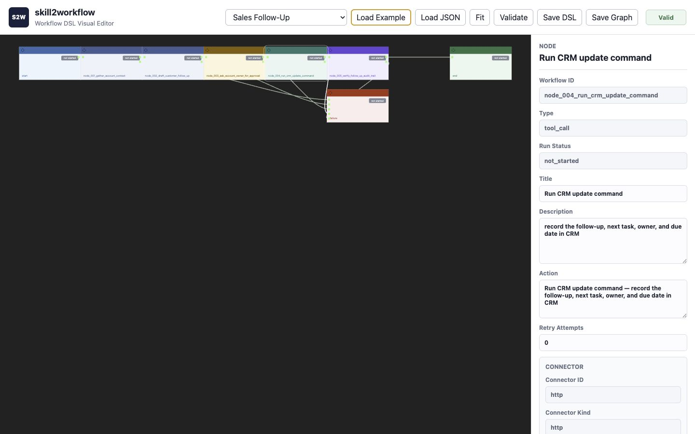
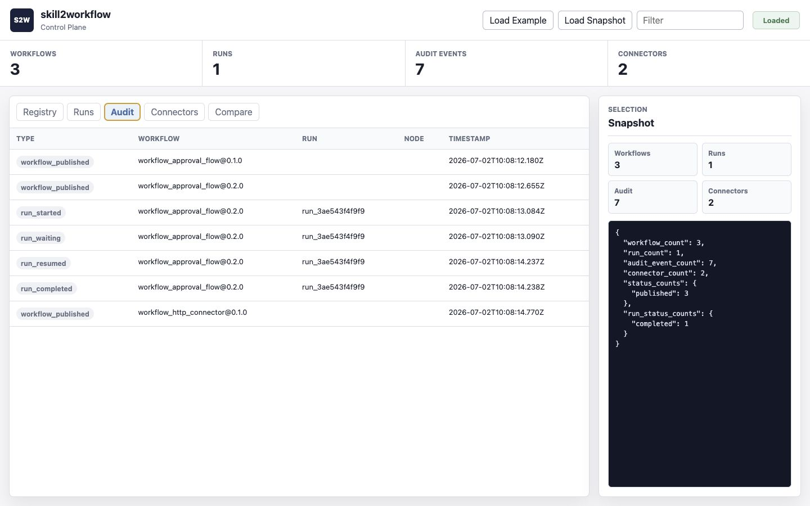
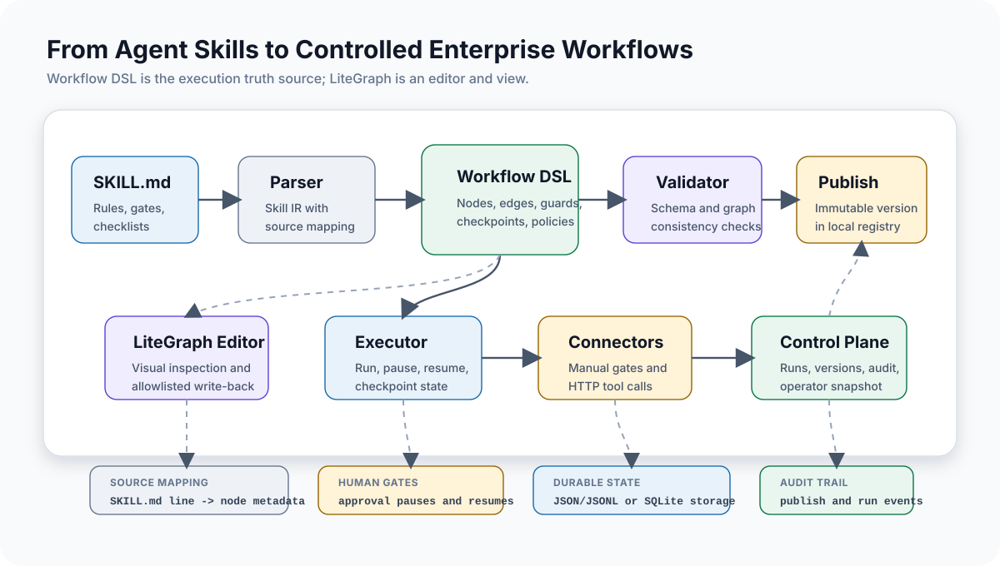

# skill2workflow

From Agent Skills to Controlled Enterprise Workflows.

`skill2workflow` is an open-source, dependency-light Agent Workflow Runtime for
enterprise AI adoption. It compiles standard `SKILL.md` capability descriptions
into controlled workflows that can be validated, published, executed, paused,
resumed, recovered, and audited.

Current maturity is **Self-hosted Beta**. The supported production direction is
a self-hosted, single-tenant runtime for one team, backed by SQLite and exposed
through an authenticated service boundary. Workflow DSL remains the execution
source of truth; LiteGraph is an editor and operational view. The runtime does
not claim exactly-once execution, hosted multi-tenancy, built-in TLS
termination, or automatic reconciliation of unknown external side effects.

[Documentation](docs/) · [Changelog](CHANGELOG.md) ·
[Security](SECURITY.md) · [Support](SUPPORT.md) ·
[Governance](GOVERNANCE.md) · [Contributing](CONTRIBUTING.md) ·
[Code of Conduct](CODE_OF_CONDUCT.md)

The core idea is simple:

- Skills answer: "Can the agent do this?"
- Workflows answer: "Will it follow the required process every time?"
- A durable executor answers: "Can the process recover, pause, resume, and leave an audit trail?"

The current controlled loop is:

```text
SKILL.md -> Skill IR -> Workflow DSL -> Immutable publication
Authenticated service -> Durable run -> Human decision -> Audit / recovery
```

## Fastest Controlled Journey

From a source checkout, install the package and create a non-overwriting secure
workspace containing a compiled, published workflow already paused at a human
gate:

```bash
python3 -m venv .venv
source .venv/bin/activate
python -m pip install .
skill2workflow quickstart \
  --root /tmp/skill2workflow-quickstart \
  --port 8080
```

The command generates an owner-only ingress secret without printing it, uses
SQLite state, and returns the waiting `run_id`. Follow the
[installed quickstart guide](docs/quickstart.md) to inspect and approve that
run, start the authenticated service, and submit a second trigger.

## Visual Overview

### Controlled Workflow Authoring

<p align="center">
  
</p>

The visual editor loads Workflow DSL, renders it as a LiteGraph-compatible graph, and exposes allowlisted edits for node text, retry policy, actions, and HTTP connector request metadata. The graph is a view and editor; Workflow DSL remains the execution truth source.
When a run-state file is provided, the editor also shows read-only node overlay evidence such as current node, status, connector outcome, attempts, retry/recovery markers, and compact trigger metadata.

### Local Control Plane And Audit Trail



The local control-plane inspector reads exported snapshots so operators can inspect published workflow versions, runs, audit events, connectors, and version comparisons without adding a server dependency.
Snapshot runs include compact per-node overlays, and the inspector's Nodes view lets operators scan run evidence without opening raw JSON.

### System Design



## Why This Exists

Agent skills have already proven useful for adapting AI systems to new tasks. They are fast to write, easy to share, and effective for many lightweight tasks.

Enterprise workflows need more control:

- Mandatory execution order
- Human approval gates
- Durable state
- Failure handling
- Recoverability
- Versioning
- Auditability
- Integration hooks

`skill2workflow` bridges that gap by compiling skills into an execution-controlled workflow runtime.

## Current Product Boundary

The current implementation is a Python standard-library runtime with an
installed CLI, SQLite production persistence, static visual inspection, and
explicit connector boundaries. It currently supports:

- Parse standard `SKILL.md` into Skill IR
- Preserve checklist source mapping with step title, detail, section, and line number
- Normalize numbered lists, bullet lists, and markdown task checkboxes
- Ignore fenced code blocks when extracting rule hints
- Compile Skill IR into Workflow DSL
- Carry parser source mapping into workflow node metadata
- Validate Workflow DSL
- Document the Workflow DSL with a versioned JSON Schema
- Validate edge ids, edge endpoints, terminal-node edges, and node transition consistency
- Emit structured machine-readable validation errors
- Execute workflows locally
- Pause at `human_gate`
- Resume waiting runs
- Persist run state as JSON or opt-in SQLite
- List run summaries with an optional bounded `runs --limit` / `control-runs --limit` window and inspect full run logs
- Inspect a bounded tail of filtered local audit events with `audit --limit`
- Store queryable run event rows when SQLite storage is enabled
- Bind `human_gate` nodes to the built-in manual connector
- Bind and validate `tool_call` connector metadata
- Execute minimal HTTP connector calls from connector-bound `tool_call` nodes
- Bound built-in HTTP request and response payloads to 1 MiB with fixed overflow and invalid-UTF-8 failures
- Resolve local credential handles for HTTP connector request headers without storing secret values in Workflow DSL or audit output
- Cover HTTP connector success, failure, invalid request metadata, JSON body, headers, and timeout behavior with local tests
- Honor connector-node `retry.max_attempts` and bounded `retry.backoff_ms`, recording retry/recovery events
- Enforce optional per-node `timeout_ms` active execution deadlines with fixed `node_timeout` evidence and successor suppression
- Enforce optional bounded `policies.workflow_timeout_ms` wall-clock deadlines, including human-gate wait time, with fixed timeout evidence
- Route exhausted `tool_call` retries through an explicit `on_fallback` path while preserving failed-attempt evidence
- Convert Workflow DSL into LiteGraph-compatible graph JSON
- Derive read-only node-level run overlays from run state and audit evidence
- Open a static LiteGraph visual editor for graph inspection and parameter edits
- Write safe LiteGraph title and description edits back to Workflow DSL
- Write safe action, retry, and HTTP connector request edits back to Workflow DSL
- Load example workflows from the editor gallery
- Publish immutable workflow versions into a local control plane
- Inspect published workflow registry/artifact consistency with a bounded,
  value-free `workflow-artifacts` report
- Promote a published version behind a stable control-plane alias such as `production`
- Run published workflow versions and write audit events
- Trigger published workflow versions or stable aliases through a compact local API envelope
- Persist trigger input values in durable run context without logging full input values to audit by default
- Map non-secret trigger input fields into HTTP connector request bodies through `connector.request.input_mapping`
- Trigger published workflow versions from local HTTP webhook POST requests
- Run a validated loopback-only long-running service with health/readiness probes, authenticated human-gate decisions, graceful signal shutdown, and SQLite restart continuity
- Operate remote human-gate decisions and cooperative cancellation through a protected token-file CLI client
- Create a non-overwriting owner-only service workspace with a generated ingress secret and absolute configuration
- Run an installed-wheel quickstart that compiles and publishes a bundled Skill, pauses at one human gate, and completes after explicit approval
- Diagnose configuration, authentication, credential-directory, SQLite-state, and loopback-bind readiness without starting or modifying the service
- Resolve connector credentials at execution time through private, bounded, descriptor-bound files while preserving atomic rotation
- Require file-backed Bearer authentication for service business routes and resolve mounted connector credentials at execution time
- Export authenticated low-cardinality Prometheus metrics and allowlisted operational NDJSON without workflow, run, request, or credential values
- Ship a dependency-free Prometheus alert starter pack for readiness, lease, uncertain-dispatch, saturation, and server-error signals
- Ship an importable, read-only Grafana dashboard over the same fixed metrics without hard-coded tenant or workflow values
- Request authenticated, durable, idempotent cooperative cancellation without claiming that in-flight external requests were aborted
- Fence process-lost executions as `interrupted` after lease takeover without replaying an unknown external side effect
- Plan and publish verified retained SQLite copies that remove expired terminal run payloads while preserving waiting work and the source
- Trigger published workflow versions from deterministic one-shot local schedules
- Dispatch durable recurring interval schedules with explicit missed-run and recovery semantics
- Inspect bounded, redacted recurring-schedule dispatch outcomes remotely, including uncertain recovery evidence
- Inspect remote workflow artifact consistency without exposing workflow content or credentials
- Create, verify, and atomically restore owner-only offline SQLite state backups
- Inspect a bounded, read-only inventory of local backups with integrity status and size metadata
- Produce a bounded, read-only backup expiration plan with a minimum-valid-backup floor
- Inspect compact, bounded local schedules and dispatch history without trigger inputs or lease identities
- Inspect compact, bounded published-workflow inventory without workflow content
- Drain due schedule work in explicitly bounded side-effect batches
- Store workflow registry and audit metadata in JSON/JSONL or opt-in SQLite
- List built-in connector manifests
- Validate and inspect the minimum connector manifest contract for future extensions
- Explicitly load one local external connector fixture through a narrow runtime registration path while keeping the default built-in registry stable
- Audit connector execution events through the control plane
- Audit runtime policy events such as `node_retrying`, `node_recovered`, and `node_failed` through the control plane
- Export a read-only control-plane snapshot with derived operator insights
- Export a bounded offline control-plane snapshot with `control-snapshot --max-items`
- Inspect operator attention items, recent events, connector events, per-node run overlays, workflows, runs, audit events, and version deltas in a static local control-plane UI
- Inspect enterprise example workflows for sales, customer service, risk review, and operations analysis
- Generate a deterministic first-run demo workspace for contributor onboarding
- Run a deterministic local pilot playbook with webhook trigger, credential handle, audit, snapshot, and node overlay artifacts
- Run a deterministic local pilot scenario pack covering customer support, sales renewal, and risk exception flows with mapped connector input
- Run a deterministic local scheduled-trigger smoke with schedule, run, audit, and snapshot artifacts
- Verify an isolated wheel, package metadata, and the installed `skill2workflow` console script
- Check committed Workflow DSL and LiteGraph examples for obvious secret-like connector values
- Run read-only release preflight checks for package version, release notes, tag availability, tests, and Python compilation
- Generate a value-free wheel provenance manifest with archive/member SHA-256 hashes and package metadata
- Provide contributor, release, compatibility, and stability documentation for open-source evaluation

## Quickstart

### Installed wheel quickstart

After installing the wheel, create a secure service workspace containing a
compiled, published example workflow that is already waiting at a human gate:

```bash
skill2workflow quickstart \
  --root /tmp/skill2workflow-quickstart \
  --port 8080
```

The command never overwrites an existing root or prints its generated ingress
secret. Use the returned `run_id` with `control-run` and `resume-published` to
inspect and approve the first controlled run. See [the installed quickstart
guide](docs/quickstart.md) for the complete service and authenticated-trigger
journey.

### Source-checkout contributor demo

Run the shortest contributor demo from a fresh source checkout:

```bash
python3 scripts/demo_bootstrap.py --work-dir /tmp/skill2workflow-demo
```

The demo compiles `examples/skills/approval-flow/SKILL.md`, publishes and runs the workflow, resumes the approval gate, and writes artifacts under `/tmp/skill2workflow-demo/artifacts/`:

- `workflow.json`
- `workflow.litegraph.json`
- `control-plane-snapshot.json`

Open the local control-plane inspector:

```bash
python3 -m http.server 4173
```

Then open:

```text
http://localhost:4173/web/control.html
```

Load `/tmp/skill2workflow-demo/artifacts/control-plane-snapshot.json` to inspect the generated operator snapshot, including the Nodes view for per-node run evidence. Rerunning the demo resets the work directory by default; pass `--no-reset` to keep existing files.

Run the local pilot playbook smoke:

```bash
python3 scripts/pilot_playbook_smoke.py --work-dir /tmp/skill2workflow-pilot
```

The pilot playbook publishes and triggers a customer-support escalation workflow through the local webhook boundary, resumes a manual gate, calls a local HTTP receiver with a credential handle, and writes inspection artifacts under `/tmp/skill2workflow-pilot/artifacts/`.
See `docs/pilot-playbook.md` for the supported pilot boundary and checklist.

Run the broader local pilot scenario pack:

```bash
python3 scripts/pilot_scenario_pack_smoke.py --work-dir /tmp/skill2workflow-pilot-pack
```

The scenario pack runs customer support escalation, sales renewal follow-up, and risk exception review against local-only receivers. It writes one set of workflow, trigger, run, snapshot, and LiteGraph overlay artifacts per scenario.

Run the local external connector prototype smoke:

```bash
python3 scripts/external_connector_smoke.py --work-dir /tmp/skill2workflow-external-connector
```

The smoke explicitly loads `examples/connectors/local_echo_connector.py`, publishes a workflow that calls it, and writes workflow, run, audit, connector, trigger, and control-plane snapshot artifacts under `/tmp/skill2workflow-external-connector/artifacts/`. The default connector registry remains `manual` and `http` unless this fixture is explicitly loaded.

Run the local scheduled-trigger smoke:

```bash
python3 scripts/schedule_smoke.py --work-dir /tmp/skill2workflow-schedule-loop29
```

The schedule smoke publishes the approval example, writes a local one-shot schedule, runs due schedules with a fixed timestamp, resumes the manual gate, and writes inspection artifacts under `/tmp/skill2workflow-schedule-loop29/artifacts/`.

Run the durable recurring scheduler smoke:

```bash
python3 scripts/recurring_scheduler_smoke.py --work-dir /tmp/skill2workflow-recurring-scheduler-loop43
```

This starts real active and standby service processes and verifies restart recovery, explicit missed-run handling, lease ownership, takeover, and stale-claim recovery.

Run the verified backup/restore drill:

```bash
python3 scripts/backup_restore_smoke.py --work-dir /tmp/skill2workflow-backup-restore-loop44
```

The drill rejects backup while a scheduler lease is active, restores an earlier point-in-time snapshot, starts a service on the restored state, performs an authenticated trigger, rejects tampering, and confirms credentials are excluded.

Run the state upgrade/migration drill:

```bash
python3 scripts/state_upgrade_smoke.py --work-dir /tmp/skill2workflow-state-upgrade-loop45
```

The drill detects valid legacy-unversioned state, creates a verified pre-upgrade backup, preserves the source, atomically publishes a copy-on-write upgrade, starts the upgraded service, performs an authenticated trigger, and rejects a future layout.

Run the runtime observability drill:

```bash
python3 scripts/observability_smoke.py --work-dir /tmp/skill2workflow-observability-loop46
```

The drill proves authenticated aggregate metrics, fixed low-cardinality labels, private-value exclusion, process-local request counters, and structured starting/ready/draining/stopped lifecycle logs across a real CLI service process.

Run the data retention/disposal drill:

```bash
python3 scripts/retention_smoke.py --work-dir /tmp/skill2workflow-retention-loop47
```

The drill proves stopped-service enforcement, aggregate planning, source preservation, removal of old terminal payloads from the published SQLite bytes, waiting/claimed protection, and a ready, triggerable retained-service cutover.

Run the durable cooperative cancellation drill:

```bash
python3 scripts/cancellation_smoke.py --work-dir /tmp/skill2workflow-cancellation-loop48
```

The drill submits cancellation while a real service request is blocked in an external connector, records the completed attempt, suppresses retry/successor progress, cancels waiting work idempotently, restarts the service, and checks compact audit evidence.

Run the interrupted-run recovery drill:

```bash
python3 scripts/interrupted_recovery_smoke.py --work-dir /tmp/skill2workflow-interrupted-loop49
```

The drill commits one provider-side effect, kills the service before its response
is persisted, waits for standby lease takeover, and proves a fenced
`interrupted` run with one provider attempt, no successor, no automatic retry,
preserved waiting work, compact audit, and aggregate metrics.

Run the package install smoke:

```bash
python3 scripts/package_smoke.py --work-dir /tmp/skill2workflow-package-smoke
```

This builds a wheel, installs it into a separate virtual environment, and runs
the installed CLI outside the repository with source-import paths disabled.
It also writes value-free `release-artifact-manifest.json` and
`release-artifact-sbom.json` companions containing archive/member hashes and an
SPDX 2.3 package inventory. It is the release-artifact check; the editable
install below remains a development convenience only.

Run the committed-fixture secret hygiene check:

```bash
python3 scripts/secret_hygiene.py examples/workflows
```

Or install the checkout in editable mode and use the console script directly:

```bash
python3 -m venv /tmp/skill2workflow-venv
/tmp/skill2workflow-venv/bin/python -m pip install --upgrade pip "setuptools>=77.0.1"
/tmp/skill2workflow-venv/bin/python -m pip install --no-build-isolation -e .
/tmp/skill2workflow-venv/bin/skill2workflow --help
/tmp/skill2workflow-venv/bin/skill2workflow validate examples/workflows/approval-flow.workflow.json --format json
```

The `PYTHONPATH=src python3 -m skill2workflow.cli ...` commands below remain the no-install source-checkout path.

Run tests:

```bash
PYTHONPATH=src python3 -m unittest discover -s tests -v
```

Parse a Skill:

```bash
PYTHONPATH=src python3 -m skill2workflow.cli parse examples/skills/approval-flow/SKILL.md
```

Compile a workflow:

```bash
PYTHONPATH=src python3 -m skill2workflow.cli compile examples/skills/approval-flow/SKILL.md -o /tmp/skill2workflow-workflow.json
```

Validate it:

```bash
PYTHONPATH=src python3 -m skill2workflow.cli validate /tmp/skill2workflow-workflow.json
```

Emit structured validation errors:

```bash
PYTHONPATH=src python3 -m skill2workflow.cli validate /tmp/skill2workflow-workflow.json --format json
```

Generate LiteGraph JSON:

```bash
PYTHONPATH=src python3 -m skill2workflow.cli visualize /tmp/skill2workflow-workflow.json -o /tmp/skill2workflow-litegraph.json
```

Generate LiteGraph JSON with read-only run overlay evidence:

```bash
PYTHONPATH=src python3 -m skill2workflow.cli visualize /tmp/skill2workflow-workflow.json --run-state /tmp/skill2workflow-state/runs/<run_id>.json -o /tmp/skill2workflow-overlay.litegraph.json
```

Apply safe LiteGraph edits back to Workflow DSL:

```bash
PYTHONPATH=src python3 -m skill2workflow.cli write-back /tmp/skill2workflow-workflow.json /tmp/skill2workflow-litegraph.json -o /tmp/skill2workflow-edited-workflow.json
```

Open the LiteGraph editor:

```bash
python3 -m http.server 4173
```

Then open:

```text
http://localhost:4173/web/
```

The editor can load either Workflow DSL JSON or the LiteGraph JSON generated by `visualize`. `Save DSL` writes edited node titles and descriptions back to Workflow DSL while preserving node ids, edges, transitions, source metadata, guards, checkpoints, and policies.
It also supports allowlisted authoring fields for actions, retry attempts,
bounded retry backoff, and HTTP connector request metadata.

Run it:

```bash
PYTHONPATH=src python3 -m skill2workflow.cli run /tmp/skill2workflow-workflow.json --state-dir /tmp/skill2workflow-state
```

Run it with SQLite-backed run storage:

```bash
PYTHONPATH=src python3 -m skill2workflow.cli run /tmp/skill2workflow-workflow.json --state-dir /tmp/skill2workflow-state --storage sqlite
```

Resume a waiting run:

```bash
PYTHONPATH=src python3 -m skill2workflow.cli resume <run_id> --state-dir /tmp/skill2workflow-state
```

For SQLite-backed runs, pass `--storage sqlite` to `resume`, `runs`, and `show` as well.

List local run summaries:

```bash
PYTHONPATH=src python3 -m skill2workflow.cli runs --state-dir /tmp/skill2workflow-state
PYTHONPATH=src python3 -m skill2workflow.cli runs --state-dir /tmp/skill2workflow-state --limit 100
```

The optional `--limit` returns only the newest 1-1000 compact summaries while
the omitted form remains a complete local list. See [`docs/run-list.md`](docs/run-list.md)
for the JSON/SQLite ordering and compatibility boundary.

Inspect a full run log:

```bash
PYTHONPATH=src python3 -m skill2workflow.cli show <run_id> --state-dir /tmp/skill2workflow-state
```

Publish a workflow version:

```bash
PYTHONPATH=src python3 -m skill2workflow.cli publish /tmp/skill2workflow-workflow.json --state-dir /tmp/skill2workflow-control
```

Publish with SQLite-backed control-plane metadata:

```bash
PYTHONPATH=src python3 -m skill2workflow.cli publish /tmp/skill2workflow-workflow.json --state-dir /tmp/skill2workflow-control --storage sqlite
```

List and inspect published workflow versions:

```bash
PYTHONPATH=src python3 -m skill2workflow.cli workflows --state-dir /tmp/skill2workflow-control
PYTHONPATH=src python3 -m skill2workflow.cli workflow workflow_approval_flow --version 0.1.0 --state-dir /tmp/skill2workflow-control
```

Promote one immutable version behind a stable trigger alias:

```bash
PYTHONPATH=src python3 -m skill2workflow.cli promote workflow_approval_flow \
  --version 0.1.0 --alias production \
  --state-dir /tmp/skill2workflow-control --storage sqlite
```

Review a release without printing workflow values, then protect the alias move
against a concurrent operator:

```bash
PYTHONPATH=src python3 -m skill2workflow.cli workflow-diff workflow_approval_flow \
  --from-version 0.1.0 --to-version 0.2.0 \
  --state-dir /tmp/skill2workflow-control --storage sqlite
PYTHONPATH=src python3 -m skill2workflow.cli promote workflow_approval_flow \
  --version 0.2.0 --alias production --expected-current-version 0.1.0 \
  --state-dir /tmp/skill2workflow-control --storage sqlite
```

See [`docs/workflow-releases.md`](docs/workflow-releases.md) for the bounded
diff and compare-and-swap contract.

Use `--version production` with `trigger`, webhook paths, or schedule
definitions. The response reports the resolved immutable version; SQLite
idempotency retries keep the original alias scope across later promotions.
See [`docs/triggers.md`](docs/triggers.md#stable-workflow-version-aliases) for
the promotion and deprecation boundary.

Run a published version and inspect audit events:

```bash
PYTHONPATH=src python3 -m skill2workflow.cli run-published workflow_approval_flow --version 0.1.0 --state-dir /tmp/skill2workflow-control
PYTHONPATH=src python3 -m skill2workflow.cli resume-published <run_id> --state-dir /tmp/skill2workflow-control
PYTHONPATH=src python3 -m skill2workflow.cli control-runs --state-dir /tmp/skill2workflow-control
PYTHONPATH=src python3 -m skill2workflow.cli control-run <run_id> --state-dir /tmp/skill2workflow-control
PYTHONPATH=src python3 -m skill2workflow.cli audit --state-dir /tmp/skill2workflow-control
```

Trigger a published version through the local trigger boundary:

```bash
printf '{"customer_id":"customer_123"}' >/tmp/skill2workflow-trigger-input.json
PYTHONPATH=src python3 -m skill2workflow.cli trigger workflow_approval_flow --version 0.1.0 --state-dir /tmp/skill2workflow-control --source local-cli --idempotency-key example-001 --input /tmp/skill2workflow-trigger-input.json
```

Triggered runs store input values under `context.input` and compact trigger metadata under `context.trigger`. Audit events and trigger responses expose `input_keys`, not full input values.

Trigger a published version through a deterministic local schedule:

```bash
cat >/tmp/skill2workflow-schedule.json <<'JSON'
{
  "schema_version": "skill2workflow-schedule-0.1.0",
  "schedule": {
    "id": "schedule_approval_flow_daily",
    "workflow_id": "workflow_approval_flow",
    "version": "0.1.0",
    "run_at": "2026-07-06T00:00:00Z"
  },
  "trigger": {
    "input": {
      "customer_id": "customer_123"
    }
  }
}
JSON
PYTHONPATH=src python3 -m skill2workflow.cli schedule-add /tmp/skill2workflow-schedule.json --state-dir /tmp/skill2workflow-control
PYTHONPATH=src python3 -m skill2workflow.cli schedule-run-due --state-dir /tmp/skill2workflow-control --now 2026-07-06T00:00:00Z
```

Scheduled runs use the same trigger boundary as CLI and webhook triggers. This `0.1.0` one-shot helper is for deterministic local evaluation. The self-hosted SQLite service supports the separate durable `0.2.0` interval contract documented in [`docs/recurring-scheduling.md`](docs/recurring-scheduling.md); neither format is a hosted cron manager or distributed queue.

Start a local webhook adapter for pilot integration testing:

```bash
PYTHONPATH=src python3 -m skill2workflow.cli webhook-server --state-dir /tmp/skill2workflow-control --host 127.0.0.1 --port 8080
```

Then send a local webhook request:

```bash
curl -sS -X POST http://127.0.0.1:8080/webhooks/workflow_approval_flow/0.1.0 -H 'Content-Type: application/json' -d '{"source":"local-webhook","idempotency_key":"example-001","input":{"customer_id":"customer_123"}}'
```

Webhook requests use the same published trigger boundary as the CLI command. The local adapter is not a hosted ingress, auth layer, queue, or production daemon.

Run with a local credential file when a connector references credential handles:

```bash
printf '{"credentials":{"demo_api_token":"local-secret-value"}}' >/tmp/skill2workflow-credentials.json
PYTHONPATH=src python3 -m skill2workflow.cli run /tmp/skill2workflow-workflow.json --state-dir /tmp/skill2workflow-state --credential-file /tmp/skill2workflow-credentials.json
```

Credential files are local-only and must not be committed. Workflow DSL stores handles, not resolved secret values.

Use SQLite run storage for published runs:

```bash
PYTHONPATH=src python3 -m skill2workflow.cli run-published workflow_approval_flow --version 0.1.0 --state-dir /tmp/skill2workflow-control --storage sqlite
```

Cancel a waiting or running published run at the next safe point:

```bash
PYTHONPATH=src python3 -m skill2workflow.cli cancel-run <run_id> --state-dir /tmp/skill2workflow-control --storage sqlite
```

Cancellation is cooperative. Read [`docs/cancellation.md`](docs/cancellation.md) before using it with side-effecting connectors.

After a crash, inspect `interrupted` runs with `control-runs`, `control-run`, and
filtered `audit`; do not replay them until the provider outcome is reconciled.
See [`docs/interrupted-recovery.md`](docs/interrupted-recovery.md).

For SQLite-backed control-plane metadata, pass `--storage sqlite` to `workflows`, `workflow`, `deprecate`, `audit`, and `audit-verify` as well.

After stopping the self-hosted service, create and verify an offline backup, then restore it into a new directory:

```bash
PYTHONPATH=src python3 -m skill2workflow.cli backup --state-dir /var/lib/skill2workflow --output-dir /var/backups/skill2workflow/2026-08-11
PYTHONPATH=src python3 -m skill2workflow.cli backup-verify --backup-dir /var/backups/skill2workflow/2026-08-11
PYTHONPATH=src python3 -m skill2workflow.cli backup-list --parent-dir /var/backups/skill2workflow --limit 100
PYTHONPATH=src python3 -m skill2workflow.cli backup-retention-plan /etc/skill2workflow/backup-retention.json --parent-dir /var/backups/skill2workflow
PYTHONPATH=src python3 -m skill2workflow.cli workflows --state-dir /var/lib/skill2workflow --storage sqlite --limit 100
PYTHONPATH=src python3 -m skill2workflow.cli schedules --state-dir /var/lib/skill2workflow --storage sqlite --limit 100
PYTHONPATH=src python3 -m skill2workflow.cli schedule-dispatches --state-dir /var/lib/skill2workflow --storage sqlite --limit 100
PYTHONPATH=src python3 -m skill2workflow.cli schedule-run-due --state-dir /var/lib/skill2workflow --storage sqlite --now 2026-08-14T00:00:00Z --max-items 25
PYTHONPATH=src python3 -m skill2workflow.cli restore --backup-dir /var/backups/skill2workflow/2026-08-11 --state-dir /var/lib/skill2workflow-restored
```

See [`docs/backup-restore.md`](docs/backup-restore.md) before using this path; the backup contains sensitive business state even though service credentials are excluded.

Before starting a newer binary against existing SQLite state, run the read-only upgrade plan and, when required, create a new upgraded directory:

```bash
PYTHONPATH=src python3 -m skill2workflow.cli state-upgrade-plan --state-dir /var/lib/skill2workflow-old
PYTHONPATH=src python3 -m skill2workflow.cli state-upgrade --state-dir /var/lib/skill2workflow-old --backup-dir /var/backups/skill2workflow/pre-upgrade --output-dir /var/lib/skill2workflow-new
```

The source directory is never edited. Follow [`docs/upgrade-migration.md`](docs/upgrade-migration.md) for the stop, cutover, validation, and rollback sequence.

Filter audit events:

```bash
PYTHONPATH=src python3 -m skill2workflow.cli audit --state-dir /tmp/skill2workflow-control --workflow-id workflow_approval_flow --version 0.1.0
PYTHONPATH=src python3 -m skill2workflow.cli audit --state-dir /tmp/skill2workflow-control --run-id <run_id> --event-type run_completed
```

Verify the SQLite audit chain without printing event payloads:

```bash
PYTHONPATH=src python3 -m skill2workflow.cli audit-verify --state-dir /tmp/skill2workflow-control-sqlite --storage sqlite
```

List connector manifests:

```bash
PYTHONPATH=src python3 -m skill2workflow.cli connectors --state-dir /tmp/skill2workflow-control
```

Export a control-plane snapshot:

```bash
PYTHONPATH=src python3 -m skill2workflow.cli control-snapshot --state-dir /tmp/skill2workflow-control -o /tmp/skill2workflow-control-snapshot.json
```

Open the local control-plane inspector:

```bash
python3 -m http.server 4173
```

Then open:

```text
http://localhost:4173/web/control.html
```

The inspector can load `examples/control-plane-snapshot.json` or a local snapshot exported by `control-snapshot`.
It opens on the Operator view, which summarizes attention items, recent audit events, connector event counts, and version changes without mutating workflow artifacts.
Use the Nodes tab to inspect the read-only `node_overlays` exported for each run. Overlay data is view state only; it is not written back to Workflow DSL.

Inspect the enterprise example pack:

```bash
PYTHONPATH=src python3 -m unittest tests.test_examples -v
PYTHONPATH=src python3 -m skill2workflow.cli validate examples/workflows/sales-follow-up.workflow.json --format json
```

The examples are documented in `docs/examples.md` and can be loaded from the web editor gallery.

Run release preflight in CI-style dry-run mode:

```bash
PYTHONPATH=src python3 scripts/release_preflight.py --version 0.1.0 --notes docs/releases/v0.1.0.md --dry-run --skip-git
```

For real release preparation, follow `docs/release-process.md` and do not skip git checks.

## Architecture

The approved architecture has five layers:

1. Skill Ingestion / Parser
2. DSL Compiler / Validator
3. LiteGraph Editor
4. Durable Executor
5. Enterprise Control Plane

The current harness implements all five layers in minimal local form. Run state, lifecycle registry state, and audit events can use JSON/JSONL or SQLite. Published workflow artifacts remain immutable JSON documents in both modes.

## Repository Layout

```text
src/skill2workflow/
  parser.py       # SKILL.md -> Skill IR
  compiler.py     # Skill IR -> Workflow DSL + validation
  connectors.py    # Built-in connector manifests and local connector execution
  control_plane.py # Local workflow registry, audit log, and connector audit events
  dashboard.py     # Read-only control-plane snapshot aggregation
  executor.py     # Durable local execution
  external_connectors.py # Explicit local external connector fixture loader
  external_connector_smoke.py # Local external connector prototype smoke helper
  storage.py      # JSON and SQLite local persistence backends
  visualizer.py   # Workflow DSL -> LiteGraph JSON and read-only run overlays
  secret_hygiene.py # Fixture secret hygiene scanner
  credentials.py  # Local credential provider boundary
  triggers.py     # Local trigger envelope helpers
  schedules.py    # One-shot and durable recurring schedule boundaries
  backup.py       # Verified offline SQLite backup and atomic restore
  webhooks.py     # Local webhook adapter for published triggers
  service.py      # Long-running self-hosted runtime service boundary
  service_doctor.py # Read-only startup readiness diagnostics
  telemetry.py    # Aggregate Prometheus metrics and safe operational NDJSON
  retention.py    # Copy-on-write sensitive runtime data retention
  pilot_scenarios.py # Local multi-scenario pilot pack helper
  schedule_smoke.py # Local scheduled-trigger smoke helper
  recurring_scheduler_smoke.py # Restart, missed-run, and lease-takeover evidence
  backup_restore_smoke.py # Point-in-time restore and restored-service drill
  observability_smoke.py # Authenticated metrics and operational-log drill
  observability_rules_smoke.py # Fixed Prometheus alert-pack contract check
  retention_smoke.py # Stopped-state retention and cutover drill
  cancellation_smoke.py # Concurrent request and cooperative stop drill
  release.py      # Read-only release preflight checks
  cli.py          # Command line interface
scripts/          # Maintainer command helpers
  release_manifest.py # Value-free wheel provenance manifest generator
examples/skills/  # Example SKILL.md inputs
examples/connectors/ # Explicit local external connector fixtures
examples/workflows/ # Example Workflow DSL and LiteGraph graph JSON
examples/observability/ # Operator-managed Prometheus alerts and Grafana dashboard
examples/control-plane-snapshot.json # Example control-plane UI snapshot
schemas/           # Versioned Workflow DSL and service configuration JSON Schemas
tests/            # Unit tests
docs/             # Product spec and implementation plans
docs/assets/      # README screenshots and system design diagrams
docs/connectors.md # Connector runtime behavior and boundary guide
docs/credential-boundary.md # Safe credential and fixture hygiene boundary
docs/examples.md  # Enterprise workflow example pack guide
docs/pilot-playbook.md # Supported local pilot path and checklist
docs/triggers.md  # Local trigger API boundary guide
docs/releases/    # Release notes
web/              # Static LiteGraph editor and control-plane inspector
.github/          # CI and issue templates
CONTRIBUTING.md   # Contributor guide
ROADMAP.md        # Open-source delivery roadmap
```

## Roadmap

Current maturity: Self-hosted Beta. The local-first harness covers all five approved architecture layers, and Delivery Loops 1-149 are complete.

Loop 40 completed a paid assisted Pilot with five approved real task creations across five `Asia/Shanghai` calendar days, two opaque private cases, one human rejection, safety exercises, and fixed verification. The finalized [redacted evidence](docs/pilot-evidence/loop-40/) records the `continue` decision without exposing task content, provider identifiers, or credentials. Live behavior remains limited to the fixed `create_task` action.

Loop 41 adds a validated, loopback-only long-running [runtime service](docs/service.md) with health/readiness probes, graceful signal shutdown, mandatory SQLite state, and restart-continuity evidence.

Loop 42 secures that service with default-deny file-backed Bearer authentication, execution-time mounted credentials, compact secret-free audit events, request-size limits, rotation evidence, and an explicit [external TLS boundary](docs/security-boundary.md).

Loop 43 completes the Self-hosted Beta gate with [durable recurring scheduling](docs/recurring-scheduling.md), explicit `latest` and `skip` missed-run policies, claim-before-execute dispatch records, restart recovery, and a shared SQLite lease for active/standby coordination. The boundary suppresses duplicate claims but does not claim exactly-once execution.

Loop 44 starts Production Baseline hardening with [verified offline backup and restore](docs/backup-restore.md): three locked SQLite snapshots, referenced workflow artifacts, SHA-256 manifests, integrity checks, atomic restore into a new directory, credential exclusion, and a real restored-service drill. Current maturity remains Self-hosted Beta while the other Production Baseline evidence remains open.

Loop 45 adds [state upgrade and migration](docs/upgrade-migration.md): explicit owner-only layout identity, legacy/current/future fail-closed preflight, a mandatory verified pre-upgrade backup, source-preserving copy-on-write migration, atomic new-directory publication, and an upgraded-service drill. Current maturity remains Self-hosted Beta while the remaining Production Baseline evidence stays open.

Loop 46 adds [runtime observability](docs/observability.md): authenticated Prometheus text metrics, a fixed low-cardinality label vocabulary, aggregate SQLite gauges, process-local request counters, and allowlisted operational lifecycle/request NDJSON. It intentionally excludes identifiers, request values, credentials, tracing, and remote telemetry storage. Current maturity remains Self-hosted Beta while the remaining Production Baseline evidence stays open.

Loop 47 adds [data retention and disposal](docs/data-retention.md): a fixed versioned policy, aggregate read-only planning, stopped-state copy-on-write application, protected waiting/claimed work, linked run/audit cleanup, SQLite secure deletion and vacuum, atomic publication, and a tested service cutover. The source and external backups remain operator-managed residual copies until securely destroyed. Current maturity remains Self-hosted Beta while the remaining Production Baseline evidence stays open.

Loop 48 adds [durable cooperative run cancellation](docs/cancellation.md): an authenticated service route and CLI, an independent SQLite request ledger, immediate waiting-run cancellation, safe points before nodes and retries, concurrent in-flight request evidence, fixed metrics, backup validation, and retention integration. It explicitly does not claim forceful external-request abort or compensation.

Loop 49 adds [interrupted-run recovery](docs/interrupted-recovery.md): service-owned execution tickets, scheduler-lease takeover, stale-writer fencing, preserved waiting and ownerless work, critical operator attention, backup validation, retention policy `0.3.0`, and a real `SIGKILL` drill proving no automatic replay after an unknown provider outcome. It does not claim exactly-once execution or automatic provider reconciliation. Current maturity remains Self-hosted Beta while the remaining Production Baseline evidence stays open.

Loop 50 adds [release-artifact qualification](docs/release-artifact-qualification.md): a real wheel build, wheel-only installation into a separate environment, scrubbed source imports, installed production-module imports, a minimum production command contract, and release-preflight enforcement. It does not publish or sign an artifact, and the package version remains unchanged.

Loop 51 adds [secure service bootstrap](docs/service-bootstrap.md): one non-overwriting command creates an owner-only ingress secret, connector directory, state directory, and absolute versioned configuration, then a real-process drill proves the generated service is ready and authenticated without manual edits.

Loop 52 adds the [installed controlled quickstart](docs/quickstart.md): the installed wheel creates a secure workspace, compiles a bundled standard Skill, publishes it into SQLite, pauses at a real human gate, completes after one approval, and accepts a second authenticated service trigger without relying on source-checkout examples.

Loop 53 adds the read-only [operational readiness Doctor](docs/service-doctor.md): one fixed, secret-free report checks configuration, ingress authentication, private credential and state directories, current SQLite integrity, and loopback address availability before service startup. The live `/readyz` probe remains authoritative after startup.

Loop 54 hardens the [connector credential boundary](docs/credential-boundary.md): directory-backed values now require private directories and regular files, use bounded no-follow descriptor reads with identity rechecks, fail without value disclosure, and retain execution-time atomic rotation. The real security drill proves an overexposed file is blocked before outbound transport.

Loop 55 adds an [authenticated live Operator snapshot](docs/live-control-snapshot.md): the running service exposes a zero-write, fixed-window control view; the CLI reads its Bearer token from a protected file, refuses insecure remote HTTP and redirects, enforces a 1 MiB response cap, and atomically writes owner-only evidence. Fixed metrics and NDJSON expose request outcomes without identifiers or payloads.

Loop 56 adds [Linux systemd supervision](docs/systemd-service.md): the CLI generates one non-overwriting, least-privilege service unit for a secure workspace, with state-only write access, hardened process isolation, restart backoff, and SIGTERM-only shutdown. Operators still review the target-host unit with `systemd-analyze verify` and explicitly enable it; no account, TLS, proxy, or host change is automated.

Loop 57 adds [authenticated human-gate decisions](docs/human-approval.md): the service accepts one exact boolean decision for one waiting run, records the authenticated ingress and durable resume evidence, follows the declared success/failure branch, and returns a fixed conflict for repeated or non-waiting decisions. It does not add hosted RBAC, multi-tenancy, or provider-side exactly-once claims.

Loop 58 adds protected [remote operator action clients](docs/human-approval.md): installed `service-resume` and `service-cancel` commands read Bearer tokens from owner-only files, reject unsafe origins, redirects, proxies, and unbounded responses, and keep the existing service protocol and execution authority unchanged.

Loop 59 adds authenticated [redacted run detail](docs/run-detail.md): `GET /runs/{run_id}` and the installed `service-show` command expose one bounded operator view before approval or cancellation, while excluding workflow DSL, trigger input, node-result payloads, connector responses, credentials, and raw errors.

Loop 60 adds authenticated [redacted run discovery](docs/run-list.md): `GET /runs` and the installed `service-runs` command expose at most 100 fixed summaries and status counts, completing the list → inspect → decide operator handoff without exporting payloads or credentials.

Loop 61 adds an authenticated [redacted support bundle](docs/support-bundle.md): `GET /api/v1/support-bundle` and the installed `service-support-bundle` command produce one bounded `0600` diagnostic artifact from fixed lifecycle, aggregate observability, and run-list data without exporting payloads or credentials.

Loop 62 adds [durable trigger idempotency](docs/triggers.md#durable-trigger-idempotency): SQLite service and control-plane triggers claim a safe key before execution, replay identical requests without a second run, and fail closed on conflicts or unknown outcomes.

Loop 63 adds [bounded active execution timeout](docs/runtime-policy.md): the existing `policies.default_timeout_ms` field is validated and enforced at durable executor safe points, persisted with the run, paused during human-gate review, and recorded as fixed timeout failure evidence.

Loop 64 adds [declarative fallback transitions](docs/workflow-dsl-contract.md): exhausted `tool_call` retries preserve the failed node and route only through an explicit `on_fallback` edge, with fixed control-plane evidence and a third LiteGraph output slot. It does not claim provider failover, compensation, or exactly-once execution.

Loop 65 adds [SQLite audit integrity](docs/audit-integrity.md): each current audit row participates in a `sha256-chain-v1`, `audit-verify` returns a fixed payload-free result, legacy audit tables are upgraded on open, invalid chains block backup verification, and retained copies are re-chained after intentional deletion. It is an integrity signal, not a signature or authenticity claim.

Loop 66 adds [bounded trigger inputs](docs/triggers.md): CLI, webhook, one-shot schedule, and recurring schedule paths enforce one shared 1 MiB canonical UTF-8 JSON-object limit before durable context or SQLite idempotency fingerprinting. Oversized values fail closed with fixed errors; the limit does not redact or encrypt business data.

Loop 67 adds [declarative trigger input contracts](docs/workflow-dsl-contract.md):
published workflows may declare a bounded JSON-Schema-like `input_schema`.
The control plane validates required fields, types, ranges, enums, nested
objects, and arrays before idempotency claims, run creation, audit emission,
or connector execution, while workflows without the field remain compatible.

Loop 68 adds [bounded service request admission](docs/service.md): one
single-tenant process permits at most 16 active non-probe HTTP handlers and
returns a fixed retryable `429` when that budget is exhausted. Health and
readiness probes remain available for safe traffic removal during overload or
graceful drain.

Loop 69 adds [stable workflow version promotion aliases](docs/triggers.md#stable-workflow-version-aliases): operators can move a bounded `production`-style alias between immutable published versions, trigger and schedule through the alias, and retain safe SQLite idempotency replay semantics across a later promotion. It does not add health-based rollout, automatic rollback, or exactly-once provider effects.

Loop 70 adds [published artifact integrity verification](docs/published-artifact-integrity.md): every published artifact is checked against its control-plane checksum before inspection, promotion, trigger, or execution. Missing or modified artifacts fail closed before idempotency, run, audit, or alias side effects; this is not a digital signature or remote-attestation system.

Loop 71 adds [reviewable workflow releases](docs/workflow-releases.md): `workflow-diff` reports bounded structural changes without workflow values, and `promote --expected-current-version` prevents a stale operator action from overwriting a newer alias target.

Loop 72 hardens [workflow release promotion](docs/workflow-releases.md):
SQLite-backed compare-and-swap validation, alias mutation, and the
`workflow_promoted` audit row now commit in one `BEGIN IMMEDIATE` transaction,
so concurrent operators cannot overwrite a newer alias target. JSON remains the
dependency-light local evaluation mode and does not claim cross-process
transaction coordination.

Loop 73 hardens [workflow publication](docs/workflow-releases.md): SQLite
inserts each immutable version and its `workflow_published` audit row in one
transaction, making concurrent version publication additive instead of
last-writer-wins. Same-version matching publishes are idempotent, mismatched
content fails closed, and deprecation updates its single registry record and
audit row atomically.

Loop 74 adds [workflow artifact consistency diagnostics](docs/workflow-artifacts.md):
the installed `workflow-artifacts` command reports bounded, value-free missing,
unsafe, invalid, oversized, checksum-mismatched, and orphaned files. Known
SQLite publication failures clean up only a newly-created matching artifact
whose registry key is still absent; the command does not perform automatic
repair or garbage collection.

Loop 75 adds [run-audit consistency diagnostics](docs/run-audit-consistency.md):
one control-plane action emits its lifecycle/runtime audit as one batch, while
`audit-consistency` compares durable run-state event counts with observed audit
counts and reports missing, duplicate, or unexpected projections without
workflow or business values. It does not make the two SQLite databases atomic
or replay external connectors.

Loop 76 adds [remote run-audit consistency](docs/remote-audit-consistency.md):
the authenticated self-hosted service exposes the same bounded diagnostic at
`GET /api/v1/audit-consistency`, and the installed
`service-audit-consistency` client validates the exact redacted report before
printing it. The read-only path works before readiness, performs no scheduler
or audit mutation, rejects redirects and oversized responses, and keeps the
two-database boundary diagnostic-only.

Loop 77 adds targeted remote audit inspection: the same authenticated endpoint
accepts `/api/v1/audit-consistency/{run_id}`, and
`service-audit-consistency --run-id` lets an operator inspect a specific run
even when the bounded global report is truncated. The target path uses the
existing safe run-identifier grammar and preserves the fixed redacted report
contract.

Loop 78 adds [remote recurring-schedule inventory](docs/remote-schedule-inventory.md):
the authenticated service exposes the bounded durable schedule definitions and
the installed `service-recurring-schedules` client shows next-run, interval,
missed-run policy, and compact last-run metadata without exposing trigger input
or allowing schedule mutation through the inventory route.

Loop 79 adds [protected remote recurring-schedule actions](docs/remote-schedule-actions.md):
the authenticated service and installed `service-schedule-enable`/
`service-schedule-disable` clients let an operator pause or resume one schedule
with an exact empty-body contract, dispatcher-safe SQLite serialization,
idempotent retries, and bounded audit evidence.

Loop 80 adds [remote recurring-schedule dispatch diagnostics](docs/remote-schedule-dispatches.md):
the authenticated service and installed `service-recurring-dispatches` client
show bounded completed, failed, skipped, and uncertain dispatch evidence while
redacting scheduler leases and trigger input.

Loop 81 adds [remote workflow artifact consistency](docs/remote-workflow-artifacts.md):
the authenticated service and installed `service-workflow-artifacts` client
report missing, orphaned, invalid, oversized, and checksum-mismatched published
artifacts with fixed bounds and no repair mutation.

Loop 82 adds [remote backup readiness](docs/remote-backup-readiness.md):
the authenticated service and installed `service-backup-readiness` client
expose a bounded, value-free preflight for SQLite layout, artifact references,
and active scheduler leases before the existing host-side offline backup.

Loop 83 adds [remote audit integrity](docs/remote-audit-integrity.md):
the authenticated service and installed `service-audit-integrity` client
verify the SQLite SHA-256 audit chain without exporting event payloads or
requiring shell access.

Loop 84 adds [remote runtime info](docs/remote-runtime-info.md):
the authenticated service and installed `service-runtime-info` client expose
fixed package, compatibility-line, state-layout, lifecycle, readiness, and
lease metadata for upgrade and rollback triage.

Loop 85 adds [remote workflow triggering](docs/remote-trigger.md): the
installed `service-trigger` command wraps the protected webhook boundary,
requires a stable idempotency key, enforces the shared input/body limits, and
validates the compact trigger response before printing it.

Loop 86 adds [remote Workflow publication](docs/remote-workflow-release.md):
the installed `service-workflow-publish` command sends one bounded DSL document
through an authenticated service, reuses immutable SQLite publication, and
returns a redacted checksum record without promoting or executing it.

Loop 87 adds [remote Workflow promotion](docs/remote-workflow-promotion.md):
the installed `service-workflow-promote` command moves one published version to
a stable alias through the authenticated service, with an optional CAS guard
and the same transactional SQLite alias semantics as the local `promote` path.

Loop 88 adds [remote Workflow diff](docs/remote-workflow-diff.md): the
installed `service-workflow-diff` command lets CI/CD and operators review the
same value-free structural changes before a remote CAS promotion.

Loop 89 adds [local ingress-token rotation](docs/service-token-rotation.md):
the installed `service-token-rotate` command atomically replaces the owner-only
service credential without printing it or restarting the running service.

Loop 90 adds [remote Workflow deprecation](docs/remote-workflow-deprecation.md):
the installed `service-workflow-deprecate` command retires one published version
through the authenticated service, removes its stable aliases, preserves the
immutable artifact, and returns a fixed redacted summary with idempotent replay.

Loop 91 adds [remote Workflow inventory](docs/remote-workflow-inventory.md):
the installed `service-workflows` command discovers bounded published-version
metadata, lifecycle status, aliases, and checksums without exporting Workflow
content, artifact paths, or audit data.

Loop 92 adds [remote retention readiness](docs/remote-retention-readiness.md):
the authenticated service and installed `service-retention-readiness` client
bind a normalized copy-on-write retention policy to a fixed preflight, report
an active scheduler lease without unsafe counts, and expose aggregate
eligibility only after a quiesced read-only inspection.

Loop 93 adds [remote operational readiness](docs/remote-operational-readiness.md):
the authenticated service and installed `service-operational-readiness` client
combine lifecycle, artifact, audit-chain, and offline-backup checks into one
bounded, value-free report without adding lifecycle mutation or claiming an
atomic cross-database snapshot.

Loop 94 adds a fixed request-body read deadline to the [self-hosted service](docs/service.md)
and [local trigger adapter](docs/triggers.md): stalled clients receive a
bounded `408` response, release admission capacity, and cannot hold the service
open indefinitely while an advertised body remains incomplete.

Loop 95 adds the fixed [deployment service probe](docs/service-probe.md):
supervisors and cutover automation can distinguish a ready service, a live but
not-ready service, and an unavailable service through the existing `/healthz`
and `/readyz` endpoints, with stable exit codes and no response-body disclosure.

Loop 96 hardens the [service and webhook body boundary](docs/triggers.md):
requests must deliver exactly their advertised `Content-Length`; early EOF is
rejected with a fixed `400` error and never reaches workflow parsing or
execution, while the existing bounded timeout contract remains unchanged.

Loop 97 adds a fail-closed [service exception boundary](docs/service.md):
unexpected request-handler failures produce only a fixed `503` response,
connection aborts avoid a second write, and telemetry/event logger failures
cannot leak internal exception details or destabilize the response path.

Loop 98 hardens [service lifecycle observability](docs/observability.md):
operational collector failures are isolated from startup, scheduler cleanup,
signal-driven shutdown, and final lifecycle transitions; durable workflow
audit evidence remains separate from best-effort operational logs.

Loop 99 hardens [service teardown](docs/service.md): scheduler startup and
cleanup failures close the listener and leave a deterministic `stopped` state
before the original failure is surfaced to the caller.

Loop 100 makes the existing [production-boundary drills](CONTRIBUTING.md)
mandatory in CI: security isolation, observability, and SQLite restart
continuity now run on every supported Python matrix entry.

Loop 101 hardens [remote operator action recovery](docs/human-approval.md):
resume and cancellation retries now reconcile a durable run-state commit with
missing control-plane audit evidence without replaying workflow execution or a
human decision. The same retry contract is documented for recurring schedule
enable/disable actions, preserving idempotent state transitions and bounded
operator evidence.

Loop 102 corrects [run-audit consistency](docs/run-audit-consistency.md) for
paused human-gate and recovered interrupted runs. Their durable lifecycle
events are counted exactly once, eliminating false `attention` results without
mutating runtime state or audit history.

Loop 103 closes the [metrics request boundary](docs/observability.md): the
authenticated `/metrics` read surface now rejects request bodies and unsupported
transfer encodings before rendering telemetry, keeping the zero-body scraper
contract aligned with the rest of the service boundary.

Loop 104 hardens [service shutdown](docs/service.md) against a startup race:
an exit request received while the scheduler is starting is preserved, so the
instance cannot publish `ready` or enter the request loop after draining began.

Loop 105 makes service lifecycle transitions atomic across shutdown callers and
the serving thread, preserving the ready/draining decision and ordered
lifecycle events under concurrent shutdown.

Loop 106 adds a shutdown admission boundary: once draining begins, mutating
routes fail closed with a bounded retryable response before authentication,
body parsing, or control-plane side effects, while diagnostic reads remain
available.

Loop 107 closes the scheduler shutdown boundary: after draining begins, no new
recurring scheduled trigger is admitted, while an already admitted dispatch
keeps the existing uncertain-outcome recovery contract.

Loop 108 adds live in-flight request pressure to the authenticated metrics
surface. The label-free gauge is aligned with the fixed request-admission
budget, excludes probes and its own scrape, and leaves the versioned support
bundle contract unchanged.

Loop 109 adds the matching live gauge for an already-admitted recurring
scheduler dispatch, making graceful-drain progress visible for background work
without changing dispatch or support-bundle semantics.

Loop 110 adds [`service-wait`](docs/service-probe.md), a bounded readiness
poller for startup and cutover automation. It reuses the existing public probe
contract, prints only the final fixed payload, and never adds a new service
route or credential requirement.

Loop 111 adds a ready-to-review [Prometheus alert starter pack](docs/prometheus-alerts.md)
for the fixed metrics surface. It stays operator-managed and dependency-free,
uses only fixed low-cardinality labels, and never mutates workflow or service
state.

Loop 112 adds a [Grafana dashboard starter pack](docs/grafana-dashboard.md) over
the same metrics. It is importable and read-only, contains no environment or
business identifiers, and leaves datasource, access, and notification policy
under operator control.

Loop 113 adds a [release artifact manifest](docs/release-artifact-manifest.md)
to the wheel qualification path. It records the archive and every wheel member
with SHA-256 hashes plus fixed package metadata, without embedding source paths,
credentials, or workflow values. It is integrity evidence, not a signature or
SBOM.

Loop 114 adds bounded connector retry backoff to the [runtime policy](docs/runtime-policy.md).
Workflows can declare a fixed `backoff_ms` delay on a connector retry policy or
its default, capped at 60 seconds and recorded in run state, control-plane
audit, and local visual overlays. The default remains zero; this does not add background
workers, provider-specific retry classification, or exactly-once execution.

Loop 115 adds a bounded global Workflow deadline to the [runtime policy](docs/runtime-policy.md).
Workflows can declare `policies.workflow_timeout_ms` up to 30 days; it starts at
run creation, continues through human-gate waiting, and fails closed with fixed
`workflow_timeout` evidence at resume and other executor safe points. It does
not forcefully abort in-flight provider calls, and standalone local executors
remain safe-point only.

Loop 116 adds the lease-owned [workflow deadline sweep](docs/recurring-scheduling.md).
The self-hosted SQLite service expires waiting runs about once per second while
holding the scheduler lease, with bounded atomic expiry, cancellation
precedence, and retry-safe terminal audit reconciliation. It never resumes a
workflow or executes a successor, and remains capped at 256 candidates per pass.

Loop 117 adds [filtered cursor-paged run discovery](docs/run-list.md). The
additive authenticated `GET /api/v1/runs` route and `service-run-page` CLI let
operators find historical failed or waiting runs without reading SQLite
directly. Pages remain redacted and bounded to 100 items/64 KiB, while the
existing `/runs` 0.1.0 tail contract stays unchanged.

Loop 118 adds bounded [per-node active execution deadlines](docs/runtime-policy.md).
Nodes can declare `timeout_ms` up to 24 hours; connector returns and retry
backoff are checked at safe points, human-gate waiting is paused, and expiry
records fixed `node_timeout` evidence without running a successor.

Loop 119 adds a bounded [HTTP connector payload boundary](docs/connectors.md).
Built-in HTTP request bodies are capped before network I/O, and success/error
response bodies are capped before entering run state; invalid UTF-8 and
oversized payloads use fixed connector failures. Explicit external connector
fixtures keep their own I/O contract.

Loop 120 hardens [first-use SQLite initialization](docs/upgrade-migration.md).
The owner-only state-layout marker is fully written and fsynced before a
non-overwriting publication, so concurrent starters never parse a partial
marker. This remains a single-directory startup boundary, not distributed
locking or replication.

Loop 121 adds [bounded local audit inspection](docs/audit-integrity.md).
`audit --limit` applies workflow/version/run/event-type filters in the storage
backend, retains only the newest matching events up to 1,000, and prints them
in chronological order. Omitting the flag preserves the complete-list path.

Loop 122 adds [bounded offline control snapshots](docs/live-control-snapshot.md).
`control-snapshot --max-items` exposes the existing window contract for local
JSON and SQLite state, retaining only the newest selected collections while
preserving aggregate totals. Live snapshots keep their fixed 100-item bound.

Loop 123 adds [bounded local run discovery](docs/run-list.md).
`runs --limit` and `control-runs --limit` retain only the newest compact
summaries up to 1,000 while the omitted flag preserves the complete-list path.

Loop 124 adds [bounded local backup inventory](docs/backup-restore.md).
`backup-list` reports integrity, creation time, layout, file count, workflow
artifact count, and byte totals for the newest local backup sets without
deleting, uploading, or exposing backup paths or contents.

Loop 125 adds bounded [backup retention planning](docs/backup-restore.md).
`backup-retention-plan` requires an explicit expiration cutoff and minimum
valid-backup floor, blocks incomplete inventories, and produces candidates
without deleting or rewriting any backup.

Loop 126 adds bounded [local schedule inspection](docs/recurring-scheduling.md).
`schedules --limit` and `schedule-dispatches --limit` retain compact newest
windows up to 1,000 without trigger inputs or lease identities; omitted flags
preserve the complete-list compatibility path.

Loop 127 adds bounded [local workflow inventory](docs/local-workflow-inventory.md).
`workflows --limit` reuses the redacted published-version contract with a
newest window of up to 100 records; omitted flags preserve the complete-list
compatibility path.

Loop 128 bounds [workflow artifact diagnostics](docs/workflow-artifacts.md)
internally: the scan keeps complete issue counts but retains only the fixed
value-free issue window, so damaged state cannot make the diagnostic result
grow with every failure.

Loop 129 adds bounded due-run batches. `schedule-run-due --max-items` limits
one invocation to at most 100 schedule records and leaves unclaimed due work
eligible for a later invocation; omitting it preserves complete-batch behavior.

Loop 130 bounds the source reads behind [run-audit consistency](docs/run-audit-consistency.md):
global inspection counts durable runs and loads only the newest 256 summaries,
while `--run-id` reads one run directly. The fixed redacted report contract and
diagnostic-only boundary remain unchanged.

Loop 131 hardens [workflow artifact diagnostics](docs/workflow-artifacts.md)
for SQLite production state: registry rows stream in stable order and orphan
checks query exact references one artifact at a time, avoiding a full registry
or filesystem-path set in memory. The report contract and JSON evaluation path
remain compatible.

Loop 132 hardens [SQLite audit integrity](docs/audit-integrity.md): chain
verification and legacy-chain rebuilds count events and stream ordered rows
instead of materializing the complete audit history. The fixed result contract,
backup validation, remote diagnostics, and JSON evaluation path remain
compatible.

Loop 133 hardens [verified backup and restore](docs/backup-restore.md): SQLite
workflow artifact references are streamed during preflight, backup creation,
and restored-state validation rather than materializing the complete registry.
The manifest, artifact checksums, restore semantics, and JSON evaluation path
remain compatible.

Loop 134 hardens [recurring scheduling recovery](docs/recurring-scheduling.md):
stale claimed dispatch rows are streamed through the SQLite recovery cursor and
updated one at a time, avoiding an unbounded restart-recovery source read. The
`uncertain` transition, no-automatic-retry rule, recovery transaction, and
return-count contract remain compatible.

Loop 135 hardens [interrupted-run recovery](docs/interrupted-recovery.md):
foreign active-execution rows are streamed through the SQLite takeover cursor
and fenced one at a time, avoiding full execution-ledger materialization. The
returned recovered states, fencing behavior, unknown-outcome boundary, and
no-replay contract remain compatible.

Loop 136 hardens [workflow release promotion](docs/workflow-releases.md):
SQLite alias promotion reads the target directly and streams only the selected
workflow's registry rows, avoiding unrelated-version materialization while
preserving CAS, alias uniqueness, audit atomicity, and JSON compatibility.

Loop 137 hardens [interrupted-run reconciliation](docs/interrupted-recovery.md):
startup audit repair streams interrupted states and checks one run/event
projection at a time, avoiding complete run-table and audit-history loads while
preserving the no-replay recovery contract.

Loop 138 hardens the live readiness probe: SQLite registry checks use a count
query instead of materializing every published workflow record, while the
complete workflow-list compatibility API remains unchanged.

Loop 139 hardens stable-alias triggers: exact versions use a direct SQLite
lookup and aliases scan only the selected workflow's registry rows, preserving
replay pinning and alias ambiguity checks without loading unrelated releases.

Loop 140 bounds each long-running service scheduler pass to 100 recurring
dispatch claims, so backlog drains in recoverable batches instead of one
unbounded lease-held transaction.

Loop 141 bounds stale-claim takeover writes to 100 rows per transaction and
renews the scheduler lease between full batches, preventing a large recovery
backlog from becoming one unbounded lease-held write.

Loop 142 applies the same fixed batch and lease-renewal boundary to interrupted
run takeover, keeping process-loss recovery writes bounded before audit repair
and recurring dispatch resume.

Loop 143 applies that boundary to interrupted-run audit reconciliation, using a
cursor-bounded 100-row repair page and lease renewal between full pages so a
large crash backlog cannot monopolize startup recovery.

Loop 144 pushes the run-detail 50-event tail down to the audit storage query,
so long retry histories do not create an unbounded diagnostic read before the
fixed redacted response is assembled.

Loop 145 adds a compact SQLite run-summary projection for bounded discovery,
pagination, snapshots, and audit consistency. Operator reads no longer parse
complete run state documents containing workflow, input, and node-result data;
full run retrieval remains available only through the explicit detail path.

Loop 146 adds a compact SQLite recurring-schedule projection for bounded
schedule inventory. Operator reads no longer parse complete schedule documents
containing trigger input; full schedule retrieval remains available through the
explicit schedule/detail and dispatch paths.

Loop 147 adds a compact SQLite run-detail projection. Authenticated detail reads
now use transactional node overlays, summary counts, and a bounded event tail
instead of parsing complete run documents containing trigger input, workflow
DSL, node results, and long event histories; complete local state retrieval
remains available through its explicit compatibility path.

Loop 148 adds a dedicated CI recovery and state-safety gate. Every change now
gets isolated backup/restore, migration, retention, cancellation,
interrupted-recovery, scheduling, and service-Doctor evidence on Python 3.14,
in addition to the existing cross-version unit and production-boundary checks.

Loop 149 adds a dependency-free [SPDX release artifact SBOM](docs/release-artifact-sbom.md)
to the wheel qualification path. The SBOM inventories every accepted wheel
member with SHA-256 checksums, binds to the archive digest, and runs in a
dedicated CI artifact gate. It is public supply-chain inventory, not signing,
reproducible-build proof, or registry publication.

The production direction is a self-hosted, single-tenant runtime for one team. See `ROADMAP.md` for the production-readiness gates, rolling Loop queue, acceptance evidence, and deferred boundaries.

See:

- [`CONTRIBUTING.md`](CONTRIBUTING.md)
- [`SECURITY.md`](SECURITY.md)
- [`SUPPORT.md`](SUPPORT.md)
- [`GOVERNANCE.md`](GOVERNANCE.md)
- [`CODE_OF_CONDUCT.md`](CODE_OF_CONDUCT.md)
- `ROADMAP.md`
- `docs/authoring.md`
- `docs/backup-restore.md`
- `docs/cancellation.md`
- `docs/human-approval.md`
- `docs/run-detail.md`
- `docs/run-list.md`
- `docs/support-bundle.md`
- `docs/remote-audit-consistency.md`
- `docs/remote-schedule-inventory.md`
- `docs/remote-schedule-actions.md`
- `docs/remote-schedule-dispatches.md`
- `docs/remote-workflow-artifacts.md`
- `docs/remote-backup-readiness.md`
- `docs/remote-audit-integrity.md`
- `docs/remote-runtime-info.md`
- `docs/remote-trigger.md`
- `docs/remote-workflow-release.md`
- `docs/remote-workflow-promotion.md`
- `docs/remote-workflow-diff.md`
- `docs/remote-workflow-deprecation.md`
- `docs/remote-workflow-inventory.md`
- `docs/remote-retention-readiness.md`
- `docs/remote-operational-readiness.md`
- `docs/service-token-rotation.md`
- `docs/interrupted-recovery.md`
- `docs/connectors.md`
- `docs/controlled-pilot-deferral-review.md`
- `docs/controlled-live-pilot.md`
- `docs/credential-boundary.md`
- `docs/data-retention.md`
- `docs/examples.md`
- `docs/observability.md`
- [`docs/prometheus-alerts.md`](docs/prometheus-alerts.md)
- [`docs/grafana-dashboard.md`](docs/grafana-dashboard.md)
- [`docs/release-artifact-manifest.md`](docs/release-artifact-manifest.md)
- [`docs/release-artifact-sbom.md`](docs/release-artifact-sbom.md)
- `docs/pilot-playbook.md`
- `docs/quickstart.md`
- `docs/release-process.md`
- `docs/release-artifact-qualification.md`
- `docs/recurring-scheduling.md`
- `docs/releases/v0.1.0.md`
- `docs/runtime-policy.md`
- `docs/security-boundary.md`
- `docs/service.md`
- [`docs/service-probe.md`](docs/service-probe.md) (including `service-wait` for bounded readiness polling)
- `docs/service-doctor.md`
- `docs/service-bootstrap.md`
- `docs/systemd-service.md`
- `docs/stability.md`
- `docs/triggers.md`
- `docs/upgrade-migration.md`
- `docs/workflow-dsl-contract.md`
- `docs/workflow-dsl-compatibility.md`
- `docs/workflow-artifacts.md`
- `docs/run-audit-consistency.md`
- `docs/superpowers/specs/2026-07-01-skill2workflow-design.md`

## License

Apache-2.0
